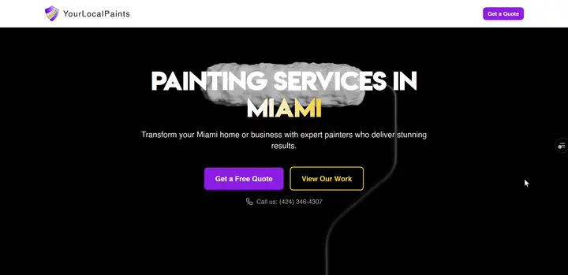
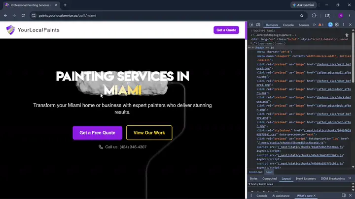
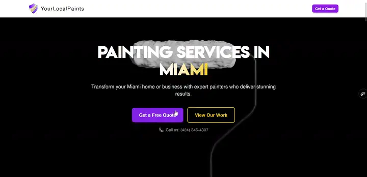

# YourLocalPaints

**SEO-first, high-converting painting services platform** built with Next.js 16 App Router, GSAP scroll animations, and a fully automated location-based routing system.



🌐 **Live:** [paints.yourlocalservice.co](https://paints.yourlocalservice.co)

---

## Tech Stack


---

## Features

### Scroll Animations + Canvas Frame Sequence
GSAP ScrollTrigger drives a 120-frame WebP sequence rendered on `<canvas>` — a paint roller animation that plays as the user scrolls through the hero section.


---

### Data-Driven Location Routing
13 cities across US + Canada (FL, TX, CA, ON, BC) — zero manual pages. Each city gets a unique route (`/{country}/{region}/{city}`), unique SEO metadata, city-injected copy, and JSON-LD structured data. Adding a new city requires editing a single file.



---

### Quote Form with S3 Upload
Multi-select service buttons, real-time validation, and direct-to-S3 image upload via presigned URLs. Images show as live previews before submission.



---

## Architecture

### Server / Client Boundary
Every route page and marketing section (Hero, Services, FAQ, Gallery, etc.) is a **React Server Component** by default. `"use client"` is used only where needed:

- `QuoteForm.client.tsx` — form state, validation, S3 upload
- `*Animations.tsx` wrappers — GSAP never runs on the server
- `BeforeAfterCard.tsx` — custom `clipPath` drag slider (mouse + touch)

### SEO Infrastructure (`src/lib/seo/`)
Every indexable page gets:
- `generateMetadata()` with unique title + description per city
- Canonical URL
- OpenGraph + Twitter card tags
- JSON-LD schemas: `LocalBusiness`, `Service`, `FAQPage`, `BreadcrumbList`
- Auto-generated `sitemap.xml` and `robots.txt`

### Data Layer (`src/data/`)
| File | Purpose |
|------|---------|
| `locations.ts` | Single source of truth for all cities — drives routes, sitemap, and static generation |
| `site.ts` | Business config: name, phone, services, social links |
| `content.ts` | Copy templates with `{city}` / `{region}` placeholders |

```ts
// Adding a new city: one entry in locations.ts
{ country: 'us', region: 'ca', city: 'san-diego', cityName: 'San Diego' }
// → generates /us/ca/san-diego with full SEO + content automatically
```

---

## Related Repos

| Repo | Description |
|------|-------------|
| [yourlocalservice-spingboot-backend](https://github.com/NikitaaOvramenko/yourlocalservice-spingboot-backend) | Spring Boot backend — form submissions, email, S3 presigned URLs |
| [TCS-Junk-Removal](https://github.com/NikitaaOvramenko/TCS-Junk-Removal) | Sister project — same YourLocal(Service) pattern, junk removal vertical |

---

## Local Development

```bash
npm i
npm run dev
```

`.env`:
```
NEXT_PUBLIC_API_URL=http://localhost:8080
```
